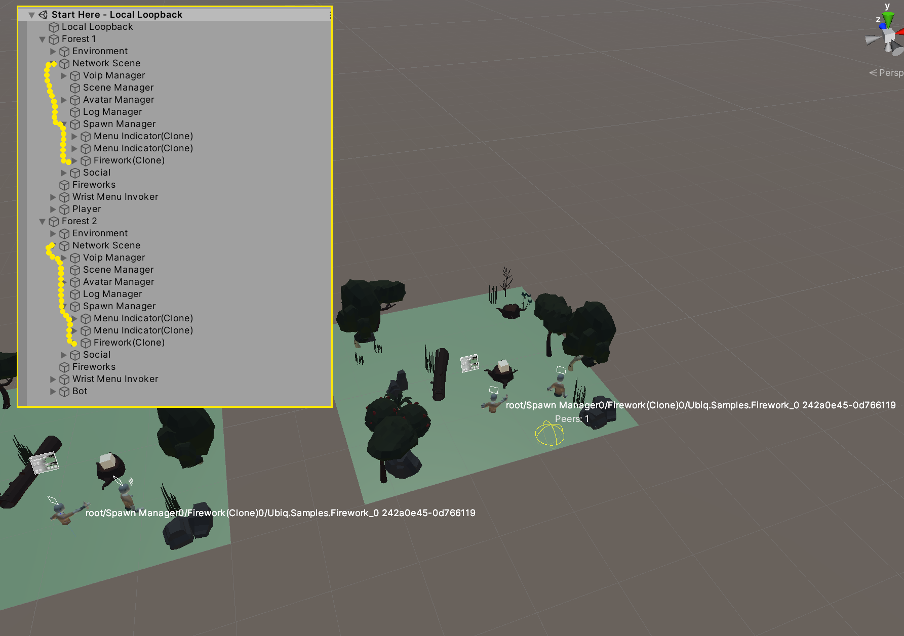
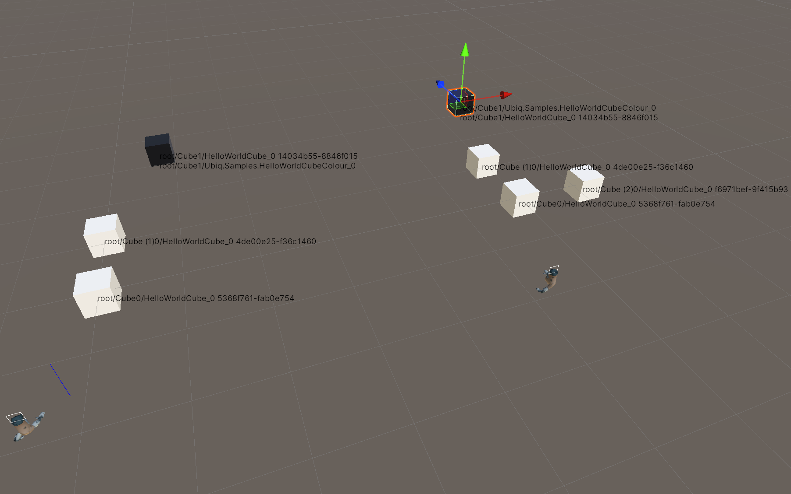

## Introduction

In Ubiq 0.0.3 we have made a number of changes to improve ease of use.

Our main goal was to simplify object addressing and initialisation - to make creating networked objects as quick and easy as possible, and avoid messages ending up where they aren't expected.

Another, separate, goal was the ability to automatically synchronise Components, for those who just want to build networked objects as quickly as possible.

Creating a simple API has a lot of challenges. We must maintain the flexibility required for research, and the transparency required for teaching.
What makes Ubiq distinct is its support for things like local loopback, cross-scene communication and asymmetric addressing - which should be as easy, if not easier, to do in any revisions.

In this post we explore our updated API. We describe how it works, and how it supports all the use cases we and our users currently rely on, as well as some new ones to try out in the future!


## Changes

The biggest change is the removal of `ComponentId`. 

Now, every _Networked Component_ has its own `NetworkId`. A Network Id is one 64-bit value, and Network Ids talk to the same Network Ids as before.

Users no longer have to store Ids or implement interfaces in their classes however; the default behaviour is to get an Id behind the scenes from the scene graph. 

The minimum overhead for a new Component is now:

```
class MyObject : MonoBehaviour
{
    NetworkContext context;

    Start()
	{
        context = NetworkScene.Register(this);
    }

    Update()
    {
        context.SendJson<T>();
    }

    ProcessMessage(ReferenceCountedSceneGraphMessage message)
    {
    }
}
```


When you call `Register` with one argument, Ubiq will generate an Id for the Component. You can get the `NetworkId` of your Component through the `NetworkContext` object.

##### Automatic Addressing


Automatic Network Ids are based on the 'address' of a Component, which consists of the nodes leading to it from the common root with its nearest `NetworkScene`. The root itself and any duplicate names are replaced by locally unique identifiers in each branch. These UTF8 strings are then SHA1 hashed into a `NetworkId`.


This approach supports local loopback, duplicate names, cross-project & cross-scene use. As it's deterministic it should also be possible to use address strings on other platforms too. (Though we recommend in this case users synchronise Ids their own way, to avoid depending on implementation details!)


To see the addresses, the helper Component `NetworkIdGizmo` can be added to a `GameObject` with Networked Components on it. In the image below, NetworkIdGizmo has been attached to both instances of a Firework in the Local Loopback Scene, and you can see how the Firework Networked Component is resolved to the same string in both forests, and that the `NetworkId` in each is the same too.



There is also a local loopback scene in _MinimalExamples/Addressing_ designed for testing this out in various configurations, including branches with duplicate GameObject names, and multiple copies of the same Networked Components added to the same GameObject, both of which are supported.




Of course, users can still assign Network Ids manually, as will be seen below!

##### AddProcessor

Additionally, `NetworkScene` has a new method, `AddProcessor`, that associates a `NetworkId` directly with a `ProcessMessage` function. This allows having multiple Network Ids for one Component, and for classes other than `MonoBehaviour` to recieve messages.

##### Namespaces

To replace Component Ids, Network Ids have been given a new _namespaces_ feature - this allows users to generate a new, derived `NetworkId` based on an existing one deterministically.


## Use Cases

The following examples show how various use cases are supported...

#### 1. Standard Networked Component

In the most common example, users create Networked Components in their scene that they want to be synchronised. They write their own `ProcessMessage` method, and build and send their own messages.

In this case users create a regular Unity Component and call `Register`. They can send via the _context_ object, and receive via `ProcessMessage`, as before.

```
class MyObject : MonoBehaviour
{
    NetworkContext context;

    Start()
	{
        context = NetworkScene.Register(this); // Messages are sent to the counterpart of this object in other NetworkScenes based on their name and position in the scene graph.
    }

    Update()
    {
        context.SendJson("My Message");
    }

    ProcessMessage(ReferenceCountedSceneGraphMessage message)
    {
    }
}
```

No subclassing or interfaces are required. 

The `ProcessMessage` method is found using Reflection (and a warning printed if it can't be found). [CreateDelegate](https://learn.microsoft.com/en-us/dotnet/api/system.delegate.createdelegate?view=net-6.0) is used to bind the reflected method, which means it should be as [fast as a native virtual method](https://blogs.msmvps.com/jonskeet/2008/08/09/making-reflection-fly-and-exploring-delegates/). 

The _MinimalExamples/Addressing_ sample shows sets of cubes synchronised this way in local loopback.

#### 2. Spawned Objects with One Networked Component

The second use case is spawned objects with one Networked Component. In this case users implement `INetworkSpawnable`, which defines a property, `NetworkId`, as before. Users should implement it with the default `get` and `set` accessors, however (no more odd initialisers!).

When the `NetworkSpawner` creates a new instance, it assigns the Network Id explicitly.

The Component is registered using `Register(this)` as before. Users don't need to pass the `NetworkId` to the Network Scene: the `Register` function detects `INetworkSpawnable` and does this itself.

(In fact, behind the scenes Network Scene looks for the `NetworkId` property directly, not the interface, to avoid creating dependencies between services and the `NetworkScene` class, so users dont actually have to declare the interface to define Ids this way).

So, a Spawnable Object would look like this:

 
```
class MySpawnable: MonoBehaviour, INetworkSpawnable
{
    NetworkId NetworkId {get;set;} // This is just to satisfy INetworkSpawnable. Users don't have to use it to register their objects, though if they do it will work the same way.
    NetworkContext context;

    Start()
    {
        context = NetworkScene.Register(this);
    } 

    Update()
    {
        context.SendJson<T>();
    }

    ProcessMessage(ReferenceCountedSceneGraphMessage message)
    {
    }
}
```

You can see this on the _Firework_ example in _Start Here_.

#### 3. Unicast Service Addressing

The third use case is unicast service addressing. This is where Components on Peers need to talk to each other, and *only* each other. 

An example is the `VoipPeerConnectionManager`, which does this to create new voice chat sessions between only two Peers.

For this use case we introduce _derived_ or _namespaced_ Network Ids. These Ids are a hash of two other Network Ids. 
So, a service such as a Peer's `VoipPeerConnectionManager` would have a `NetworkId` created by combining its _Network Scene_ Id with a _service_ Id. 

For `VoipPeerConnectionManager`, the service Id is `c994-0768-d7b7-171c`.

Components on other Peers can work out how to address a specific Peer's Component, based on the specific Peer's `NetworkScene` Id and the shared secret (service Id).

This example is a little more complex, and doesn't use the Context object:

```
class VoipPeerConnectionManager: MonoBehaviour
{​​​​​​​
    NetworkId serviceId = new NetworkId("c994-0768-d7b7-171c"); // The unique service Id that specifies we want to address the VoipPeerConnectionManager class
    NetworkScene scene;


    Start(){​​​​​​​
        var scene = NetworkScene.Find(this);
        NetworkScene.Register(this, NetworkId.Create(scene.Id, serviceId)); // Here we create a new Id for this VoipPeerConnectionManager *instance*
    }​​​​​​​


    Update()
    {​​​​​​​
        foreach(var otherPeer in otherPeers)
        {​​​​​​​
            scene.SendJson(NetworkId.Create(otherPeer.networkId, serviceId), myMessage); // Address the unique instance of VoipPeerConnectionManager on a specific Peer, by working out what it will have set its unique Id to...
        }​​​​​​​
    }​​​​​​​


    ProcessMessage(ReferenceCountedSceneGraphMessage message)
    {​​​​​​​
    }​​​​​​​
}​​​​​​​
```

When creating derived Ids, the second parameter can be a `NetworkId`, like in the example above, but it can also be an integer, or a string. So a service identifier could just be a name like "VoipPeerConnectionManager", instead of a UID.


#### 4. Multicast Service Addressing

The fourth use case is multicast service addressing. This is where services need to talk to all other services (typically including some outside Unity). An example is the `ThroughputBenchmark` Component. 

This is very similar to how regular Networked Components work - the only difference is the `NetworkId` is fixed, and set at design time, instead of being generated from the scene graph.

The implementation is similarly simple too: the Component is registered as before, but the Id is explicitly assigned when calling `Register`.

```
class MulticastService: MonoBehaviour
{
    NetworkContext context;

    Start()
	{
        context = NetworkScene.Register(this, new NetworkId("162a-5711-6a98-4218")); // The shared service Id. All instances will talk to all other instances.
    }

    Update()
    {
        context.SendJson(); // Address all other instances of this service
    } 

    ProcessMessage(ReferenceCountedSceneGraphMessage message)
    {
    }
}
```

#### 5. Spawned Objects with Multiple Networked Components

The fifth use case is spawned objects with multiple Components. An example of this is the `ThreePointTrackedAvatar`, or any other Component attached to an Avatar.

`NetworkSpawner` can handle Prefabs with multiple Network Components, so users can simply implement `INetworkSpawnable` on each Component. 

Or if they prefer, users can use the namespace/derived Network Ids to create Ids based on the one assigned by the Network Spawner. (This is how the Component Ids used to work.)

Option 1:

```
ThreePointTrackedAvatar: MonoBehaviour, INetworkSpawnable
{
    // The NetworkSpawner can handle Prefabs with multiple networked components, and will synchronise each of them correctly.
    Start()
    {
        context = NetworkScene.Register(this);
    }
}
```

 

Option 2:

```
ThreePointTrackedAvatar: MonoBehaviour
{
    //'avatar' is a member of ThreePointTrackedAvatar and is itself INetworkSpawnable. This allows us to get an Id derived from the one the spawner sets on Avatar, based on the string "ThreePointTrackedAvatar".
    Start()
    {
        context = NetworkScene.Register(this, NetworkId.Create(avatar.NetworkId, "ThreePointTrackedAvatar");
    }
}
```

#### 6. Multimode Addressing

The sixth use case is multimode addressing. This is used where the same Component needs to handle broadcast and unicast messages in one. This is used, for example, by `LogCollector`.

In this use case the `AddProcessor` method is used to register callbacks to multiple Ids, each with a differnet usage! 

The Ids themselves (or more accurately how they are used) determine whether a message is delivered via multicast or unicast.


```
public class LogCollector : MonoBehaviour
{​​​​​​​
    NetworkId broadcast;
    NetworkId unicast;
    NetworkId destination; // can change as a result of a broadcast
    NetworkScene scene;
    
    Start()
    {​​​​​​​
        scene = NetworkScene.Find(this);
        broadcast = new NetworkId("162a-5711-6a98-4218"); // A shared address
        unicast = NetworkId.Create(broadcast, scene.Id); // A unique address
        scene.AddProcessor(broadcast, ProcessMessage);
        scene.AddProcessor(unicast, ProcessMessage);
    }​​​​​​​
    
    public void RequestDestinationChange()
    {​​​​​​​
        scene.SendJson(broadcast, new Message(unicast)); // Broadcast my Unicast Id to all other Peers
    }​​​​​​​


    public void ProcessMessage(ReferenceCountedSceneGraphMessage message)
    {​​​​​​​
        if(IsBroadcast(message))
        {​​​​​​​
            destination = message.id;
        }​​​​​​​
        else
        {​​​​​​​
            HandleUnicastMessage(message);
        }​​​​​​​
    }​​​​​​​
}​​​​​​​
```

In the example above, the Log Collector class uses a broadcast message to change which unicast address all other Log Collectors in the Peer Group should send their unicast messages to.


#### 7. Networked Behaviours

The seventh use case is for those who already know the basics of message passing, and just want to create networked behaviours as quickly as possible.


In this use case Ubiq automatically synchronises the members of a Component without the user needing to send or receive messages themselves.

 
A new system has been added for this: _NetworkedBehaviours_. All users have to do is register their component like so...

 
```
public class MyNetworkedBehaviour : MonoBehaviour
{    
    public float property1;
    public string property2;
    
    [SerializeField]
    private float property3;
    
    private string property4; // Not transmitted

    Awake()
    {
        NetworkedBehaviours.Register(this); // Note we are calling NetworkedBehaviours.Register(), not NetworkScene.Register()!
    }
}
```
 

The class uses the Unity JSON utility underneath, and so follows the Unity Serialisation rules...

* public fields, but not properties, 
* private fields with [SerializeField], 
* lists, but not dictionaries
* [and more](https://docs.unity3d.com/2020.1/Documentation/Manual/JSONSerialization.html)

In the future we could add functionality to swap the serialisation library, or add [interfaces](https://docs.unity3d.com/ScriptReference/ISerializationCallbackReceiver.html) to control the behaviour. 


Users can also add the `NetworkTransform` attribute to their `MonoBehaviour`, and Networked Behaviours will synchronise the local transform as well:

```
[NetworkTransform]
public class MyNetworkedBehaviour : MonoBehaviour
{
    ...
}
```


The way this works underneath is that `NetworkedBehaviours` is a static class that creates methods to serialise and deserialise the `MonoBehaviour` outside of the `MonoBehaviour` itself. This is why Networked Behaviours does not need users to subclass their Component. These methods are then registered with the Component's closest `NetworkScene` on its behalf.

This is demonstrated in the _MinimalExamples/NetworkedBehaviour_ scene. 

There is also another example in the _Addressing_ scene, demonstrating that custom Networked Components and Networked Behaviours Components can be intermixed on one GameObject, and both will still work.


## Conclusion

Our latest update has retired probably most confusing aspect of object addressing: the ObjectId/ComponentId separation. 

All Components now have their own, complete, NetworkId. This should hopefully bring Ubiq's behaviour closer to the ideal mental model of Components talking to other instances of themselves.

Ubiq still routes messages the same way as before: with Ids multicasting to matching Ids. And it is still possible to register an explicit Id, and send to another, explicit, Id. We hope now with only one variable to worry about - and new ways of creating it - users will feel more confident to mix and match, and try out new atypical communication patterns, like those shown above!

As part of these revisions we have maximised the use of Reflection to remove interfaces and other requirements on setting up Components, that without an obvious reason left intialisation tricky and potentially error prone. 

We hope the cleaner API makes it easier for users to create new Networked Components so they can focus less on Ubiq, and more on coding new & interesting networked behaviours.


Do you have a particular use case or application in mind? We always appreciate hearing from our users! So please feel free to share any thoughts on these updates on our [GitHub Discussion](https://github.com/UCL-VR/ubiq/discussions) page, or reach out to [Sebastian](mailto:sebastian.friston@ucl.ac.uk) or [Ben](mailto:ben.congdon.11@ucl.ac.uk) directly.
