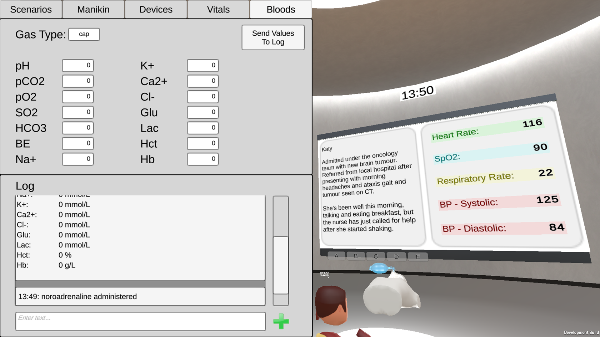
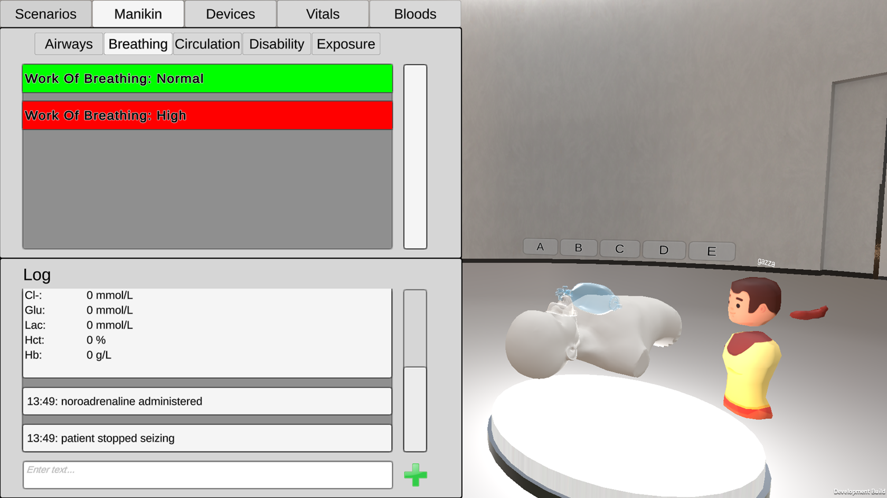
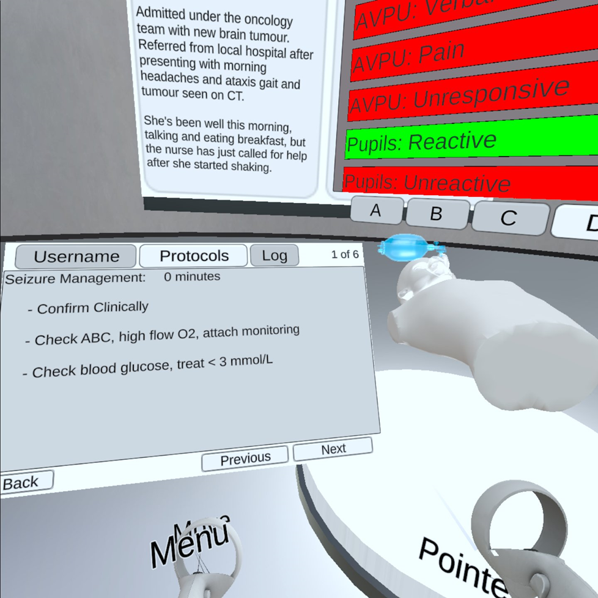

*This is a guest post by Endrit Pajaziti. Endrit is a researcher at the Institute of Cardiovascular Science and co-creator of [VheaRts](https://www.vhearts.org/). Previously the VheaRts team wrote about their experiences working with Ubiq to demo VheaRts at the WCPCCS conference ([link]()). They've since extended out their application to aid real-time clinical training. Thanks Endrit for sharing this with us! -- Ben Congdon*

Around the globe, a common theme in healthcare is the seemingly ever-increasing workloads which directly affect the time clinical staff have to commit to training and practice. At Great Ormond Street Hospital, the Centre for Clinical Simulation has been working hard to bridge the gap and provide the necessary means for staff to practice essential skills - varying from communication-based training (using actors) to emergency paediatric scenario simulation (with high-end manikins). At the centre, there are dedicated, fully equipped wards where participants can take part in mock clinical scenarios while monitored through a one-way glass window. The team can adjust certain parameters in real-time, such as the state of the manikin (for example, making the pupils dilate or simulating a seizure) or to the vitals monitor in the mock ward. This works extremely well, however the growing potential of VR presents a few questions, such as: can we do this remotely? Can we do this with multiple participants at the same time? Our manikins often have issues, can we do clinical simulation more cheaply using VR headsets?

There are numerous difficulties involved in building a VR application which can replicate the functionality of one of the simulation rooms in the hospital. Many of these lie in the difficulty to build realistic, believable and intuitive graphics and interactions within a clinical environment. Our plan was to use parts of our VheaRts application demonstrated at the World Congress of Pediatric Cardiology and Surgery, previously written about on this site ([link]()). Therefore, considering all these factors, we decided to start by building a low-fidelity application, and testing the core functionalities of a VR clinical simulation environment with users to see if a prototype could be useful. This approach was chosen since it would reduce the time to the first prototype and allow us to see if we could effectively use VR to run scenarios with students and trainees. Also, even with a lot of effort, a "realistic" approach may still be insufficiently convincing, thus creating a barrier for the participants to authentically interact with the content and learn from each other and the scenario.

Dr Andrew Cook demonstrating a heart procedure at the World Congress of Pediatric Cardiology and Surgery (WCPCCS) using VheaRts and Ubiq.

For these reasons, we decided to create a low-fidelity environment in which participants could practice communication, team-working and following clinical protocols to work through and solve scenarios. The term we used for this was "clinical reasoning". We chose to use Ubiq since it provided all of the functionalities we required, such as being able to create an instance of a room in a secure server (based within UCL), generate avatars for users, send messages over the network and store the states of variables as "room properties". As also shown in WCPCCS 2023, the ability to use a local instance of Ubiq on a laptop/router combination gives us the possibility to take the setup anywhere, which is especially useful in healthcare since hospital Wi-Fi is notoriously unreliable and firewalls are often an issue when using networked applications.

The way the application works is that there are two versions: a Quest (android) build and a windows build. While the users are immersed in the VR room, the educator has control over the environment using the desktop build. Parameters such as vitals, manikin states, devices and more can be tweaked in real-time. A text log is present in both VR/PC which allows the communicator to note specific events (which might not have a dedicated button), and these can be seen by participants in VR. This could be noting down the dosage of a drug administered (for example). A panel for entering bloods values (creating a bloods report) is a secondary use of the text log. In VR, users have the ability to read the text log, to read clinical protocols which have been transformed into VR-suitable versions and also to enter/edit their avatar name. They can also inspect the states of the manikin, which are presented as lists hovering above the manikin model. The manikin states are organised in a ABCDE assessment format, to encourage the users to follow clinical protocols in emergency situations (airways, breathing, circulation, disability, exposure). Some pre-built scenario templates have been included in the application, such as a sepsis and seizure scenario, which also have the appropriate clinical protocols built in VR.

The application is currently in a prototype phase and is ready for testing within the next few weeks, and we will be recruiting medical students from UCL for a first run through.

Educator (Desktop) view - blood panel.

Educator (Desktop) view - manikin panel.

Student (VR) view.