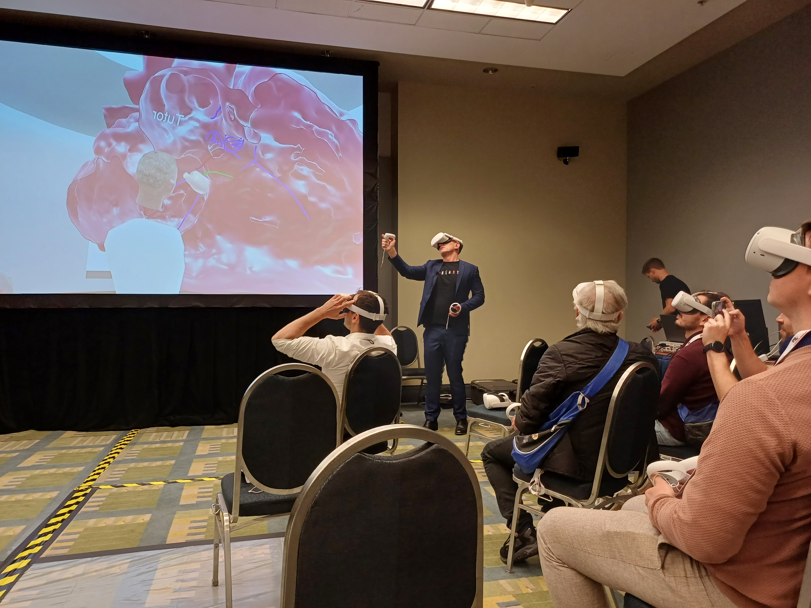
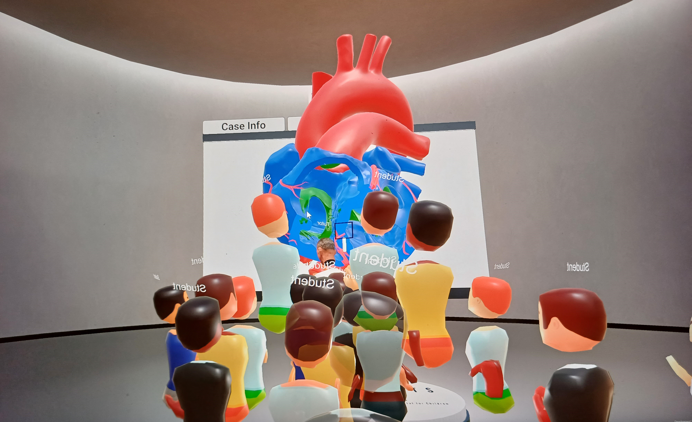

Conferences and industry fairs are fantastic opportunities to show one’s project and do networking of the human kind. The networking of devices, however, is a different story. Conference networks are notoriously overcrowded, and even good infrastructure sometimes struggles with the large number of attendees and their numerous devices. This is a problem for demonstrations that rely on devices being networked together with little latency, such as social VR applications.

This was a problem for our colleagues at the Institute of Cardiovascular Science (ICS) at UCL and the Great Ormond Street Hospital (GOSH) because they were scheduled to host multiple virtual anatomy labs over five days at the World Congress of Paediatric Cardiology and Cardiac Surgery (WCPCCS). The WCPCCS is a conference which occurs typically once every four years. It brings together cardiologists, cardiac surgeons, and other specialists in the field of paediatric cardiology to present new research, facilitate discussions and demonstrate emerging technologies. The team from ICS and GOSH was scheduled to give lectures on 7 various paediatric congenital heart conditions using their multi-user VR app VheaRts.

VheaRts is a networked VR application for the visualisation and interaction with virtual models of human hearts. VheaRts allows not only the visual inspection of the 3D heart but the models can also be dissected, enlarged, annotated and more. Since congenital heart defects are often complex and highly variable, VR is highly suitable for evaluating and understanding patient cardiac anatomy better. VheaRts also allows for other imaging data to be included in VR (e.g., videos of echocardiograms), and includes a virtual handheld simulator to practice echocardiography in VR. In the past, it had been successfully used for surgical planning and teaching but had not been used at a conference at this scale. At WCPCCS, VheaRts would need to be able to support sessions with up to 30 users every day for five days in a row.

Dr Andrew Cook demonstrating a heart procedure using VheaRts and Ubiq.

Our colleagues thought it would be too risky to rely on the crowded conference Wi-Fi and instead set out to create a local wireless network that would be independent and separate from the conference infrastructure. All the VR devices (Meta Quest 2) would be connected to a single access point that they would not need to share with anyone else. However, this also meant that our colleagues would need to host their own server since their networking solution was not peer-to-peer. Up to that point, VheaRts had used the Photon Unity Networking (PUN). PUN is a pre-packaged solution for networked applications in Unity and offers not only code and examples for a quick application but also hosts the servers. Different subscription tiers provide the users of PUN with extra support and more server capacity. Unfortunately, self-hosting is only available for the most expensive subscription packages, so they decided to move VheaRts off PUN and use Ubiq instead. This was not only cheaper (Ubiq being free), but also gave them access to the server software for themselves. 

The final setup consisted of one laptop running Ubuntu, one Ubiquity AP AC Pro access point, and 36 Meta Quest 2 headsets. The laptop was configured so that it was DHCP, DNS, and Ubiq server for the independent network. It was connected to the access point via a wired connection. The AP had a minimal configuration because its sole purpose was to offer Wi-Fi and route all traffic to the laptop. The VR headsets did not require any special configuration beyond selecting the network created by the AP.

With this setup, the VheaRts team travelled to Washington and participated in the WCPCCS from the 27th of August to the 1st of September 2023. Over the five days, they hosted 17 virtual anatomy labs with an estimate of about 475 attendees in total using VR. Even more participants viewed the session on a projected screen because not enough headsets were available. The sessions were very successful and created a large turnout with many positive comments on the application and the experience. More importantly, our colleagues reported that there were no connection losses, drops, or lags at all. They thought that the switch to the independent network with Ubiq not only increased stability but also made running the sessions more comfortable because they did not have to deal with connectivity issues. They also felt that it made VheaRts more flexible and accessible because they now can take it to places without reliable local Wi-Fi or where security policies prevent access. Both have been issues in the past with using VheaRts in hospitals. With all the connections under the control of our colleagues, the independent network setup also makes it easier to ensure data protection when VheaRts is used to review patient data; another important concern when using VheaRts in a clinical setting.

Lastly, this project benefitted not only our colleagues but also Ubiq itself. The open-source nature of Ubiq allowed our colleagues to change it as required and to feed their changes back to us. During their integration of VheaRts, they found a few features and extensions they thought we were missing such as an automatic reconnection after a connection loss. They have created pull requests and we have integrated their changes.

In conclusion, our colleagues from ICS and GOSH presented a new and interesting use case for Ubiq and demonstrated that such a local setup can support at least 30 clients at the same time without instabilities. They are enthusiastic about taking VheaRts to new places they could not go before and want to continue Ubiq for all of their networking needs.

The virtual classroom during one of the sessions.