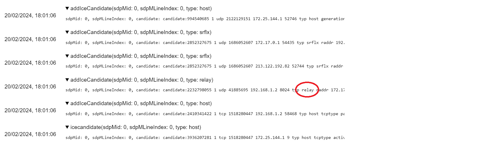

Installing the Ubiq server is straightforward. However, to be able to use all its features requires a few dependencies.

These containers are designed to support local deployments for things such as experiments, or [special events]( "VR Hearts"). 

In the future we aim to add streamlined support for cloud service providers such as AWS as well.


# Docker

For our containerisation we use [Docker](https://www.docker.com/), as it is extensive and highly popular, maximising the likelihood of users being able to find support for it in whatever ecosystem they'd like to deploy.

## Dockerfile

The container is provided as a `Dockerfile`, found in `/Containers/Docker/` of the Ubiq repository.

The Dockerfile points to a specific tag when getting the server, and is updated with each server change, initialising the version of the server to the latest one supported by that branch. So checking out an older branch, will build an image with an older version of the server.

Once the correct branch has been cloned, the image can be built with the following command (with `/Containers/Docker` as the working directory):

```$ /ubiq/Containers/Docker> docker build -t ubiq .```

Once the image has been built, you can run it. How you do that depends on where and how you want the image to run.


## Image Features

The image built contains the Ubiq server, an instance of [coturn](https://github.com/coturn/coturn) for VOIP, and a pair of self-signed certificates to enable Secure WebSockets.

The tasks remaining before running the image are:

1. Open the relevant ports on your firewall
2. Identify the hostname or IP through which clients can connect

Once these are done, you are ready to start the image.


## Running locally in Docker Desktop

In this case, we will run the image on a typical PC with Docker Desktop installed.

### Hostname

Some parts of the configuration may need to know where they are publicly accessible from. There is no way for the Docker instance to know this, as it runs in a virtual network. Therefore it must be told its public address via the `--hostname` option:

```> docker run -it --hostname localhost ubiq```


### Certificates

To provide Secure WebSockets and TURN, the server needs a TLS certificate and private key.

The Dockerfile will generate a self-signed certificate. If you want your server to be accessible to the public though, you will need to replace the self-signed certificates with those from a CA associated with the domain on which the image is available.

This can be done by mapping a local directory containing the certificates to the `/certs` folder using the `-v` option. Your certificate and key should be called `cert.pem` & `key.pem`, respectively.

For example, on Windows it might be:

```> docker run -it -v "D:\Certs\":"/certs" --hostname localhost ubiq```


### Ports

Finally, it is necessary to publish ports on the host. This must be done even if the EXPOSE command is used in the Dockerfile, as that only exposes the ports within Docker's virtual network; it doesn't open them on the host.

```> docker run -it -p 8009-8030:8009-8030/tcp -p 8009-8030:8009-8030/udp ubiq```

With this command, it is possible to remap ports. This should be avoided however, as some Ubiq services may self-describe themselves to Peers.

The list of ports that need to be mapped is available via the EXPOSE commands in the Dockerfile.

#### TURN Ports

Only a few TURN ports are opened in this Dockerfile, since Docker will create a proxy process for every mapped port, so opening the typically thousands of ports of a normal TURN server would take a long time to start. 

If you want to open more ports, this can be changed in the `turnserver.conf` file, though in this case you'd want to run the container with another Docker [network driver](https://docs.docker.com/network/drivers/).

If running a temporary local deployment like the [VheaRts group]( "VR Hearts"), then few or no TURN ports will be required, as all Peers will be on the local network anyway.

The complete command then for Docker Desktop on Windows might be:

```> docker run -it -v "D:\certs":"/certs" -p 8009-8030:8009-8030/tcp -p 8009-8030:8009-8030/udp --hostname localhost ubiq```


## Further Comments

* Beware that the APIs section of the [Status Module]() is blank, meaning all the `Rooms` Status APIs will be open. Though, we expect most users not to make this port public in the first place.


## Testing the Deployment

Once you've started the image, you should see that the server has opened up services on the correct ports, and also a message telling you which certificates it is using.


You should now be able to join from all the clients, including the Browser Samples. Take care that when using the self-signed certificates, you'll need to visit the WebSocket Server as an HTTPS page and accept the connection manually in the browser, before making a Secure WebSocket connection.

You can also use tools such as Chrome's WebRtc Internals (`chrome://webrtc-internals/`) to check that the TURN server is delivering ICE candidates correctly.

