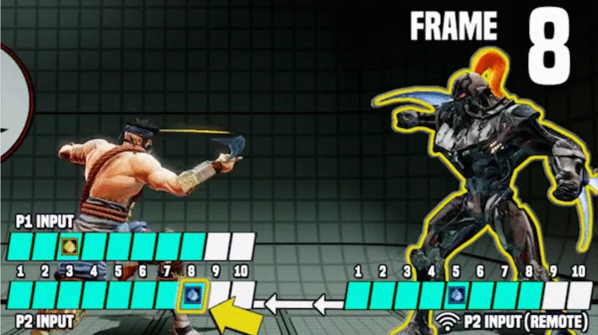
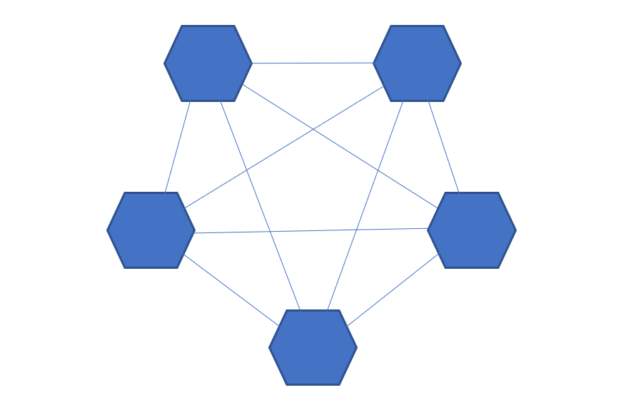
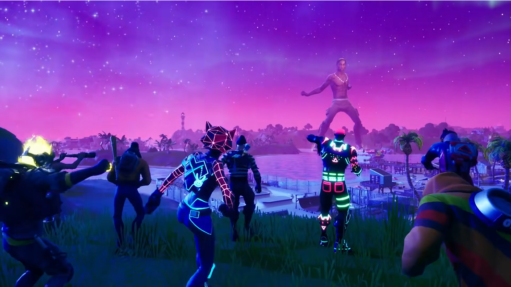
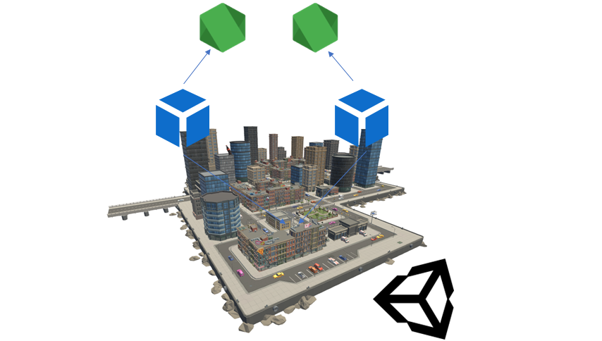
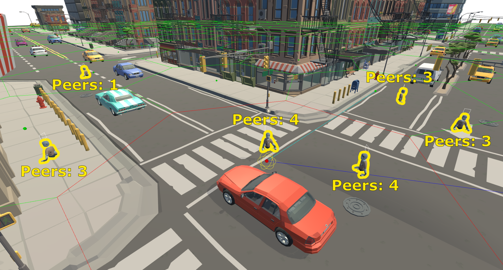

Ubiq is logically Peer to Peer, but when communicating over the public internet the Ubiq server is used as a hub. Messages from rooms are duplicated or "fanned-out". This implementation is simple and robust, but can create a choke-point when large numbers of users congregate in one room: and this is what the paper is focused on.

To see why this is, and understand [the paper](https://doi.org/10.1109/DS-RT58998.2023.00016)'s goals, we need a wider view of scalability in social VR...

### Shared States

All collaborative applications and games, including Social VR, are based on users having the same mental model of the world. 

If both users imagine the state and rules of the world the same way, their actions will make sense to one another. If their mental models diverge, the world is no longer shared. Each player sees the others interacting with a world they cannot comprehend. This is useless for communication, and in competitive games can appear unfair.

A simple example is "[wall hacks](https://www.vice.com/en/article/935gn7/counter-strike-cheat-players-see-through-walls)" in games like Counter-Strike, where one player uses exploits to see through walls and gain an advantage over others. In this case players are seeing different things because their software is doing different things.

Another example is where two players have different latencies, e.g. in Fighting Games. The player with a lower latency can execute moves more quickly than their opponent, gaining an advantage. This isn't due to the software itself, but the infrastructure of the internet. Fighting Games use a [variety of methods](https://arstechnica.com/gaming/2019/10/explaining-how-fighting-games-use-delay-based-and-rollback-netcode/) to counteract the effects of latency for precisely this reason.

*Illustration of Latency in a Fighting Game (Source: Ricky Pusch, ArsTechnica, 2019)*

To ensure users have a consistent view of the world, changes made by one Peer need to be communicated to all the others as fast as possible.

#### Scalability

As real networks have latency, the *fastest* way to do this is to make each client send a message 
directly to every other in a mesh pattern.

However, as the number of clients grows, the number of connections and messages sent grows exponentially, and soon the resources of the network and PCs will be overwhelmed.

For all but the trivial group sizes, the number of messages exchanged must be reduced somehow.

One way to do this is to put the game logic on a server. Now each client communicates with one machine, which runs the game, and sends one response.

Client-server architecture is about more than just scale. A dedicated server is a source of authority, helping to prevent cheating, as one example, and this architecture has many [more implications](https://www.amazon.co.uk/Networked-Graphics-Building-Virtual-Environments/dp/0123744237) as well.

What it cannot do however, is scale infinitely. 

To create sessions with users beyond the capacity of one server, the servers themselves have to be connected and exchange messages, and we are back to the fundamental trade-off in social VR:

**The architecture must aggregate and compress messages to keep the total bandwidth down - but every time this is done it introduces latency, and removes information.**

For example, to get spatialised audio, a Peer needs (1) audio streams, and (2) locations, from every other Peer around them, so those streams can be mixed in way that gives the listener the right impression of where those peers are. 

A single PC or Quest cannot mix the streams of 1000, or even 100, other players and do anything else at the same time. In this case we'd use dedicated servers to uniformly mix audio streams, and send one copy of this mix to each player. This is how larger video-conferences work. The processing has been offloaded and the message count is reduced, but now players all hear the same mix regardless of where they are: we've lost spatialisation.

This challenge is present for every modality in VR, and each one has to be handled differently.

### Crowds

An obvious question given these challenges, is how do SVRs like Horizon Venues or MMORPGs like World of Warcraft solve them?

The simple answer is, that they don't, not really. Games like World of Warcraft use [*sharding*](https://wowpedia.fandom.com/wiki/Sharding_(term)) where users are partitioned into different copies of the world running on different servers. Users in different copies cannot interact however.

When Travis Scott [performed in Fortnite](https://www.theverge.com/2020/4/23/21233637/travis-scott-fortnite-concert-astronomical-live-report) to [12.3 million](https://www.marketingdive.com/news/fortnite-virtual-rap-concert-draws-record-123m-attendees/576781) people, this was done by broadcasting to multiple servers. Users saw real attendees on their local server, but not all attendees actually shared the same space.

*First person view of Fortnite's Travis Scott Concert. (Source: [Mariana P. Silva, 2021](https://www.linkedin.com/pulse/future-entertainment-immersive-experiences-through-technology-silva/))*

Yet, the immense success of these events (not to mention technical challenges even of "just" broadcasting them) show that there is a real demand for social situations well beyond the small group interactions of contemporary social VR, and maybe beyond what would even be possible in the real world...

Each game or platform can use different tricks to give the illusion of scale, depending on its purpose. 

(Eve Online is rather unique in that it actually does connect 1000's of players in the same space - however it does so by [slowing down the simulation](https://www.eveonline.com/news/view/introducing-time-dilation-tidi) as needed, not something you'd want to experience in VR!)

### Peer To Peer and Server Fanout

Ubiq's Peer to Peer architecture was chosen for a few reasons. 

First is its flexibility: client-server patterns can be implemented on top of P2P but not vice-versa. Second, it is more accessible for smaller teams - there is no need to maintain a client & server version of the application. 

Finally, the underlying network infrastructure can be swapped out, and applications will continue to work.

We could replace the server with [broadcasting or multicasting](http://www.steves-internet-guide.com/introduction-multicasting/), for example, without changing the design of any Networked Components.

Multicasting [was proposed](https://doi.org/10.1109/VRAIS.1995.512473) for huge distributed simulations as early as 1995. In this case, messages are replicated in the network hardware itself at Layer 3 or 4, massively increasing the capacity of the network, and so session size.

Unfortunately, support for multicasting on the public internet is not reliable, and though it increases the capacity, at some user count, we'd still need aggregation and compression.

Ubiq's server was built in full knowledge that the capacity of each room is limited, and that to scale to 100s and 1000s of users, that additional systems will need to be built. 

In our recent paper, we took the first steps towards this, by trying to understand the current limits of the server, and the implications of different relay & routing models that might improve it.

### Bots

To perform this investigation, we used Ubiq's [Bots](https://ucl-vr.github.io/ubiq/botssample/) functionality. Bots are computer controlled Peers that can join a room, transmit and receive audio, and move around. Multiple Bots can exist in one Unity process, but each Bot has its own `NetworkScene` and from the system's point of view is indistinguishable from a user (even when running in the same process as other users or Bots).

You can begin to explore the Bots in the [Bots Samples](https://ucl-vr.github.io/ubiq/botssample/).

For this experiment we added some Editor Tools that could spin up multiple processes, each with multiple Bots, on AWS VMs, and remote-control them.

For this remote control we used Ubiq as well: each process had a `NetworkScene` dedicated to spawning Bots. Each Bot had its own `NetworkScene` for its role as a Peer. The two Peer Groups were completely separate and talked to different servers, but used shared Unity processes to communicate for remote control.

### Experiments

We first benchmarked the server to establish a baseline. The headline number is that about 30-40 Peers can be supported in one room with our current configuration.

We then set out to see how partitioning approaches could improve the capacity of a session.

The idea behind a partitioning scheme is that only a subset of Peers actually communicate, but that these groups aren't symmetrical.

Imagine in a large crowd, you can talk to the two people closest to you, but no-one else. Those people you can speak with are close to you, but may not be close to *eachother*. This is KNN - or K Nearest Neighbour.

If you shared news with one person, and they repeated it to their other neighbour, your information moves through the groups and might eventually reach everyone in the session. However, the way it moves and is transformed is very different to if you'd just announced it to everyone yourself...

There are trade-offs to every partitioning scheme.

The other scheme we considered is a Hex-Based Spatial Partitioning. 

Neither scheme is a silver-bullet however: implementing such schemes do not make Social VR 'scale'. As we saw with the audio example, schemes need to be chosen and tuned per-modality.

The purpose of these experiments was to understand the effect of those schemes on server capacity, so that maybe in the future they *could be* applied to certain problems.

In the paper, we actually incorporate this into our experiments.

The Bots are not just used to generate traffic, but behave like Boids and so influence each others behaviour. Since Boid behaviour can be modelled, we can capture the motion of the Bots and see how it changes under different partitioning schemes.

These simple Boids don't generalise to real user behaviour, but they clearly illustrate that schemes aren't just about message rates, but also timing and mutual visibility: all of these affect information propagation, and so behaviour.

### Conclusion

Our experiments showed that both partitioning schemes significantly improved fanout capacity. This is not a surprise, as we know both ultimately reduce message rates.

Understanding how they do so however is important.

To build scalable VR, some type of aggregation and compression will be needed, and it will have to be modality specific.

A scalable system supporting real concert sized crowds will involve a hierarchy of processes for combing, replicating or forwarding messages from different sized clusters of machines above and below, as information moves up and down the hierarchy, between users at varying distances, roles and attentions.

This is a huge challenge, and this paper is only a tiny part of it, but unlocking all the social situations enabled by having a system that can do it for real, will be well worth it.

### Paper

> S. Friston, O. Olkkonen, B. Congdon and A. Steed, "Exploring Server-Centric Scalability for Social VR," 2023 IEEE/ACM 27th International Symposium on Distributed Simulation and Real Time Applications (DS-RT), Singapore, Singapore, 2023, pp. 56-65, doi: 10.1109/DS-RT58998.2023.00016.

Is [available Open Access from UCL](https://discovery.ucl.ac.uk/id/eprint/10182150/)