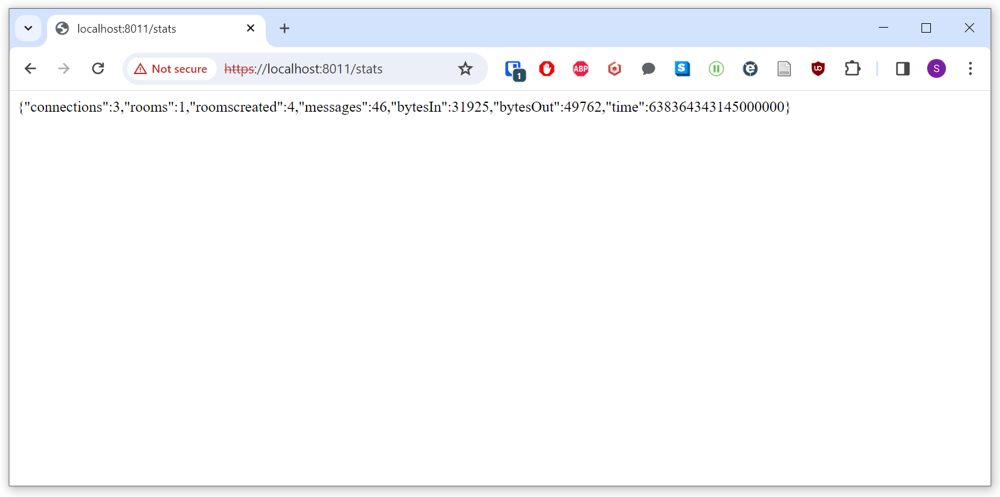

We have just released a major update to our Node platform code. This encompasses the server, and JavaScript modules for use in the Browser.

This update includes an upgrade to TypeScript, new unit tests, a new status module and a number of other quality of life improvements.

The server API remains unchanged, so this upgrade has already been applied in-place and transparently. If you do not write code for the server, you will not need to do anything.

If you do however, this post explains each change in detail, and what it means for you as a developer.


## TypeScript

The most visible change is that our JavaScript code is now written in [TypeScript](https://www.typescriptlang.org/).

TypeScript adds type annotation to JavaScript. This allows catching errors earlier and improves the self-documenting capacity of the code. It also allows improved schema validation for better runtime stability. 

All of the code in the Node platform folder has been updated: the Ubiq, Server modules and Components packages. The only exception are the two sample Node Peer applications.

We would like to thank [TheBv](https://github.com/TheBv) for contributing the bulk of these changes to the server.


### ts-node

The project uses Node's [loaders](https://dev.to/jakobjingleheimer/custom-esm-loaders-who-what-when-where-why-how-4i1o) feature to enable Node to execute TypeScript directly.

For the majority of developers, your user story is unchanged. The browser samples also work identically to before.

The only breaking change is that the server can no longer be started simply via "node app.js", but instead, by:

```
node --loader ts-node/esm app.ts
```

or

```
NODE_OPTIONS="--loader ts-node/esm"
node app.ts
```

or

```
npm start
```

This is because TypeScript is its own language. Normally TypeScript is compiled to JavaScript, and then that JavaScript is executed.

ts-node hides this by transpiling in real-time. This avoids the need for an additional build step or build artefacts to keep in sync, and permits debugging against the original TypeScript file.

You can also set the `NODE_OPTIONS` environment variable system wide.


`npm start` is possible because the `package.json` has been given a [script](https://www.knowledgehut.com/blog/web-development/package-json-scripts-node-js) `start` which is simply a shortcut to `node --loader ts-node/esm app.ts`.

Using `npm start` is the recommended way to start the server now, as the script entry can be updated behind the scenes to encompass any future changes.


### VSCode

In VSCode, the recommended launch config for the server looks like:

```
{
	"type": "pwa-node",
	"request": "launch",
	"name": "Launch Server",
	"skipFiles": [
		"<node_internals>/**"
	],
	"env": {"NODE_OPTIONS": "--loader ts-node/esm"},
	"program": "${workspaceFolder}\\app.ts",
	"console": "integratedTerminal"
}
```


### PM2

`npm start` works with [pm2](https://pm2.keymetrics.io/).

The way a the server process is created on nexus, for example, is:

```
pm2 start npm -- name "ubiq-server" -- start
```

Where "ubiq-server" is the app name, which can be anything you like.


### Package Extensions

When writing a package's `index.ts` file, the extensions of the imports must be .js, even though the files on disk are .ts.

For example, the `index.ts` for the Modules package contains...

```
export { IceServerProvider } from './ice.js' // The extension must be .js even though the files on disk are .ts
export { RoomServer } from './roomserver.js'
export { Status } from './status.js'
```

A more detailed [discussion of this](https://dev.to/ayc0/typescript-50-new-mode-bundler-esm-1jic) is available. Briefly however, in Ubiq we leave the extensions as .js.

The reason is that for TypeScript to accept .ts extensions, the option `allowImportingTsExtensions` must be set, but this creates issues with our bundler, Rollup.

If either changes in the future this will be updated, but it shouldn't affect importing or consuming modules. 

You only need to keep it in mind when updating or adding new modules.


## Zod

One of the advantages of TypeScript is the closer integration of validation and static typing.

The server now uses [Zod](https://github.com/colinhacks/zod) for validation. This allows defining a schema and a type in one, such as:

```
const JoinArgs = z.object({
    joincode: z.string().optional(),
    uuid: z.string().optional(),
    name: z.string().optional(),
    publish: z.boolean(),
    peer: PeerInfo
});

type JoinArgs = z.infer<typeof JoinArgs>;
```

Note how the `JoinArgs` type and `JoinArgs` schema objects have the same name. This is possible in TypeScript because the typing universe is separate from the object universe.

Some types defined with Zod are also exported. For example, the RoomServer exports Message definitions, which are imported by the RoomClient in Components. This ensures that these types are only ever defined in one place.


## Linting

The project now has a linter, [ESLint](https://eslint.org/), installed. A linter enforces a consistent coding style, making the code more readable, and catches common errors and anti-patterns.

Linting is not performed as a discrete build step. It is expected that the IDE, such as VSCode, will warn about linting errors during development.


## ESM and CJS

[ECMAScript (ESM) and CommonJS (CJS)](https://konstantin.digital/blog/es-modules-all-you-need-to-know) are two ways to specify dependencies between JavaScript modules.

In brief, CJS considers each .js file a different module, and modules are imported using `require('module.js')`. ESM is the newer way to create modules, using a `package.json` file to describe a module consisting of a number of .js files.

ESM is standardised, and is the recommended way to do define modules going forwards.

The project now uses ESM exclusively (even in the samples that do not use TypeScript).


## Browser Samples

The only change to the browser samples is that they now use ESM everywhere as well, whereas previously the Ubiq library would have been imported as CJS.

This means the `<script>` tags are unchanged, but inside each sample's .js file, instead of writing, say

`import Ubiq from "/bundle.js"`

You would now write

`import { NetworkScene, NetworkId } from "/bundle.js"`

And instead of creating a type from the Ubiq module

`const scene = new Ubiq.NetworkScene()`

You can now use the imported class directly

`const scene = new NetworkScene()`

The [browser samples](https://github.com/UCL-VR/ubiq/tree/samples-browserextended) have already been updated.


## Unit Tests

We have now introduced a set of unit tests for the libraries based on [Jest](https://jestjs.io/).

The tests currently cover the server modules and components.

The tests are configured to run using an existing server instance. This allows running the tests against a server to which the debugger is attached. 

This means that the server must be started manually before executing the tests.

Where this server is is determined from the `default` and `test` config files. By default it assumes there is a server on `localhost`.

To execute the tests from the command line, give the command `npm test`.

We also recommend installing one of the VSCode extensions for Jest. For example, [Jest Runner](https://marketplace.visualstudio.com/items?itemName=firsttris.vscode-jest-runner). This allows starting a test from within the IDE under a debugger.

The project uses [Jest Resolver](https://www.npmjs.com/package/ts-jest-resolver) to ensure Jest works with our imports (which use .js, as described above).

When making changes to the server code, the unit tests can be used to ensure there are no regression errors. We will add additional unit tests to improve coverage as time goes on.


## Status Module

The server has a new module aimed at improving stability and visibility.

The status module creates a dedicated HTTP server through which basic information about the server's state can be established. The API can be used to poll the server for statistics, and see information about rooms. Importantly, the server has a dedicated API for uptime tests.

In the future this API will be extended with the ability to manipulate the server. For example, deleting rooms or changing properties.

The status module is written such that all the APIs are intended to be interacted with programmatically. That is, they send and receive structured JSON objects. The server runs on its own port. There is an entry in `default.json` to configure it.

Once the server is started, the API can be accessed with HTTP GET requests. For example, visiting `https://localhost:8011/stats` in a browser (with a local server running) will show a number of statistics about the server:




### Public and Private APIs

Another endpoint is the rooms API: `https://localhost:8011/rooms`. This will show a list of UUIDs for all currently existing rooms. You can then give one of the UUIDs as a parameter to get more detailed information about that room, e.g. `https://localhost:8011/rooms/fc587165-7174-466b-89c4-cd421d235732`.

Being able to access room UUIDs this way is potentially sensitive, so this API and similar ones are secured behind an API Key. This is a UUID that must be provided with the request, or else the status module will return a [401](https://developer.mozilla.org/en-US/docs/Web/HTTP/Status/401). 

The key(s) must be provided in one of the config files, e.g.

```
"status":
{
	"port": 8011,
	"cert": "./cert.pem",
	"key": "./key.pem",
	"apikeys": ["40b14fa9-230d-43a6-b5f4-0b6c6cca5fd2"]
},
```

After which the key must be be provided in a cookie, or via a query parameter, e.g.

`https://localhost:8011/rooms?apikey=40b14fa9-230d-43a6-b5f4-0b6c6cca5fd2`


Nexus has been given an API key accessible only to the Ubiq team members.

**If no API key is set, then all APIs default to public, not private, so be sure to configure this if your server can be accessed externally.**

The status module is now the supported way to capture server parameters for experiments, and the status streams have been removed in this update. 

### Notes on security

As we always say when introducing Ubiq, Ubiq is designed to operate in a high-trust environment. The API keys are in place not to protect the server from malicious actors, but to make it harder for users sharing a resource (i.e. the server), to *accidentally* interfere with each other.

Without the ability to get a list of rooms programmatically, users can't write code that, for example, enumerates and joins said rooms.

Writing secure code is hard, and beyond the scope of our team. For building a truly secure public facing app, we recommend opening a [discussion on GitHub](https://github.com/UCL-VR/ubiq/discussions).


### WebRTC 

The rtcpeerconnection sample has been removed. This sample used [wrtc](https://www.npmjs.com/package/wrtc) to establish a PeerConnection with Node. 

This has been removed partly because wrtc looks like it is out of development. Additionally, for WebRTC & JavaScript, the Browser samples now serve as working examples. 

Finally, the WebRTC API is very difficult for non-experts to work with. Our recommended way for users to send audio and video for server-side processing, is to serialise and transmit it themselves. This is the approach used by our own projects.


## Future Work

This is the first of two large server projects.


In our next project, we aim to enhance the extensibility of the server. This has two main aims:

1. To make it possible to add 'server-level' NetworkComponents, that exist just above a Room. This will allow users to create server features without altering upstream code. It will also allow us to split off certain services such as the Blob API and Discovery APIs into their own modules.
2. To make it easier to subclass the Room and RoomPeer types to add abilities that are not encompassed by (1). This came out of our [scalability project](https://doi.org/10.1109/DS-RT58998.2023.00016), which needed to change the behaviour of how messages were routed between rooms. We would like to be able to support projects like this without needing any upstream changes.


## Conclusion 

The TypeScript upgrade has improved the quality of the code and revealed a number of minor issues that have been resolved, while the other changes lay a foundation for more efficient server feature development in the future.

We hope despite how invasive these changes are, there will be little to no change of the vast majority of projects, including those that already work with the server.

In future posts we will go into more detail about the Status Module, and our new proposed features.

As always, please reach out on Discord, GitHub or via E-mail with suggestions and comments!