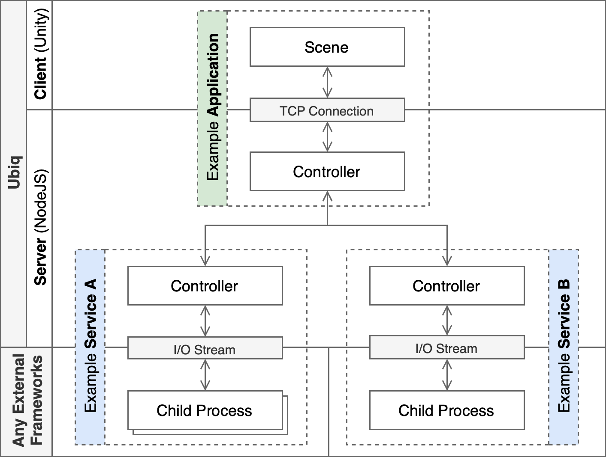
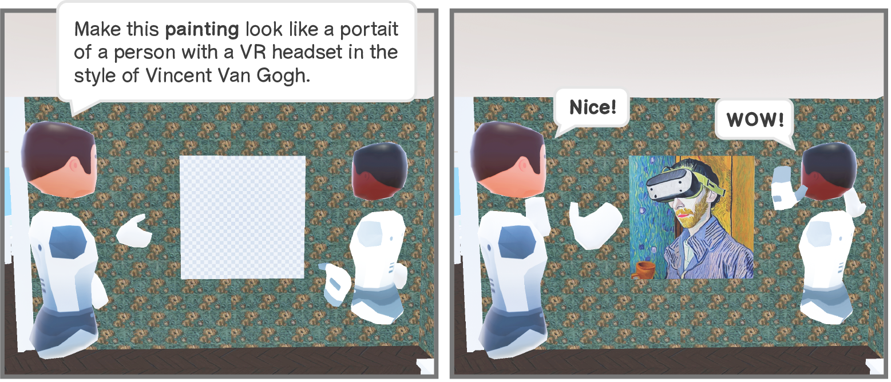
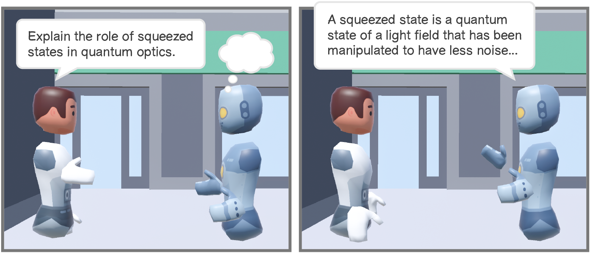

<!-- ## Demo Video -->
<!--  -->

<!--   -->

The integration of external (open-source) projects with social virtual reality (VR) has the potential to enhance the way we collaborate within virtual environments. For example, recent advances in generative AI provide the ability to synthesize textual, auditory, or visual data, enabling new types of virtual experiences. However, these applications often require a high level of processing power, which is typically not available on untethered mixed-reality devices.

Ubiq-Genie addresses this by building on the open-source Ubiq social VR platform and provides a modular approach to server-assisted social VR applications. We present two prototypes of collaborative applications to showcase the potential of Ubiq-Genie in the context of generative AI including an embodied conversational agent based on ChatGPT and a voice-controlled texture generation method based on Stable Diffusion 2.0.


More details on Ubiq-Genie incl. full descriptions of the prototypes and opportunities for future research can be found in our [paper](/publication/ubiq-genie).



The source code of Ubiq-Genie is available on [GitHub](https://github.com/UCL-VR/ubiq-genie) and is licensed under the [Apache 2.0 License](https://github.com/UCL-VR/ubiq-genie/blob/main/LICENSE.txt).


### System

The Ubiq-Genie architecture consists of three main components: the Unity scene, applications, and services. The Unity scene serves as the interface for VR users and communicates with a server-side component called the `ApplicationController`. The `ApplicationController` acts as a central coordination point for one or more different services and communicates with the `ServiceController` of each service. The `ServiceController` is responsible for providing a specific function and orchestrates the data flow of one or more underlying child processes through the I/O stream of the server's operating system. 

We implemented several services including speech-to-text, image synthesis, conversational text synthesis, file server, and text-to-speech. The addition of new services and the creation of applications is described on a page in the [Ubiq-Genie GitHub repo](https://github.com/UCL-VR/ubiq-genie/tree/main/Server).

### Prototype 1: Texture Generation

This prototype application allows users to collaboratively generate textures for objects within a virtual environment (CVE) using voice commands or ray-based selection. The application uses a server-side image synthesis model (Stable Diffusion 2.0) that generates highly detailed and diverse textures, making it possible for users to create realistic and unique designs without requiring intensive processing on the client side.

Interaction with the prototype is simple and intuitive. Users can specify the desired appearance of an object through voice commands, such as "Make the floor look like lava." Alternatively, they can use ray-based selection by pointing their controller at the object and pressing the trigger button, and then specifying the desired appearance verbally.

### Prototype 2: Multi-party Conversational Agent

This prototype application allows users to collaboratively interact with a conversational agent through voice prompts in a virtual environment. The agent is represented by a robot-like avatar and has the ability to engage in multi-party conversations with users. Users can interact with the agent through voice prompts, ranging from simple questions to complex questions involving other users. The agent's response is spatialised and accompanied by hand gestures and a visual speech indicator. The agent also turns towards the users who speak to indicate that it is listening.

### Future Work and Conclusion

The proposed Ubiq-Genie architecture presents a wide range of opportunities for future research and development. The currently implemented services and applications can be expanded to create new user- and researcher-centred applications ranging from content creation to user behavior analysis.

Overall, the proposed system architecture and the implemented prototypes demonstrate the potential of integrating external (open-source) frameworks into social VR, which can enable a wide range of enhanced experiences. We hope that the Ubiq-Genie system architecture can serve as a starting point for researchers and developers to further explore the potential of integrating external frameworks and services into social VR.