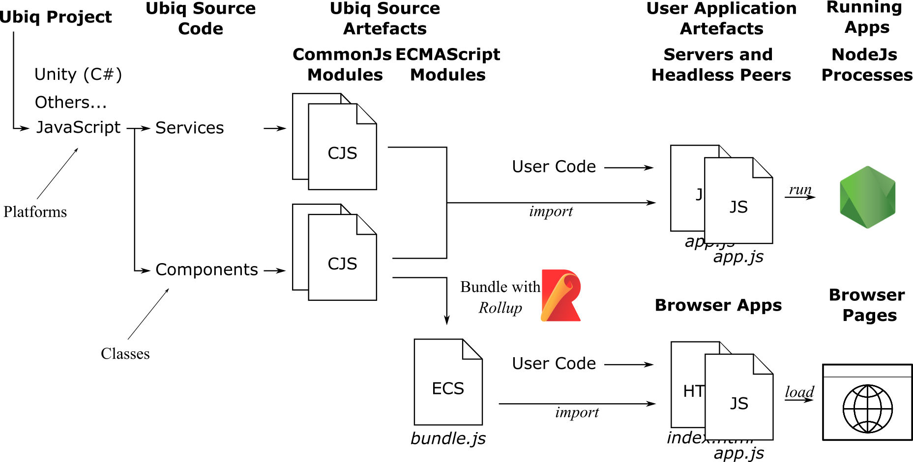
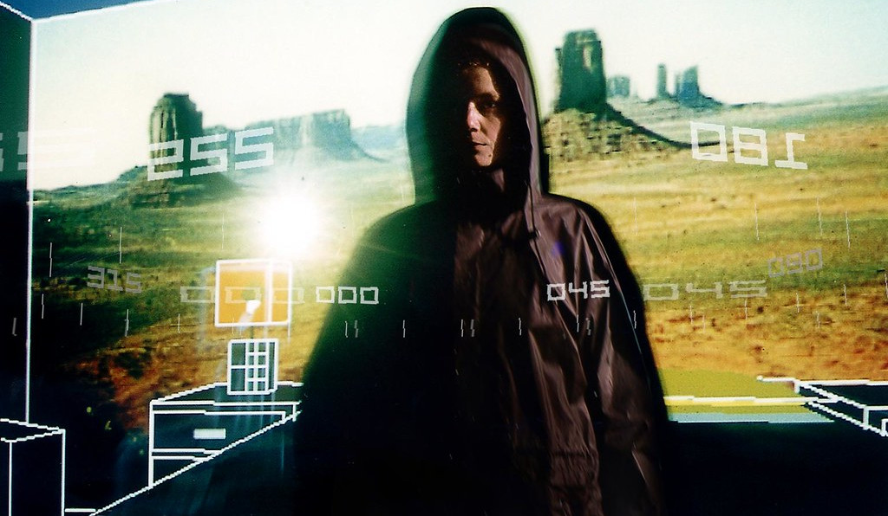
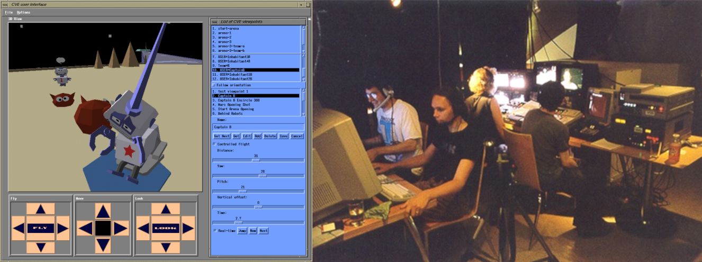
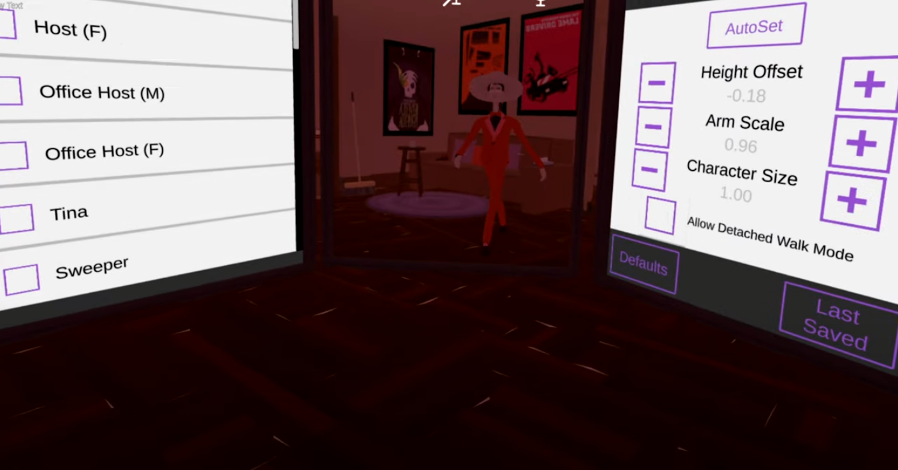
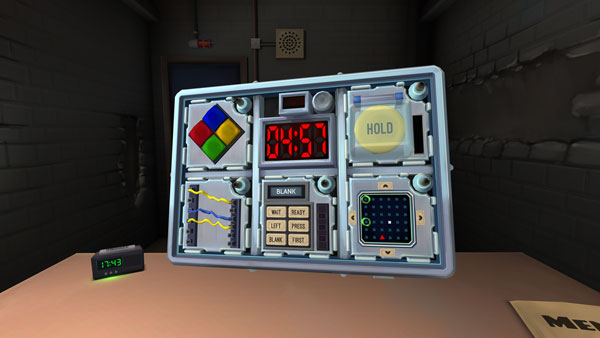
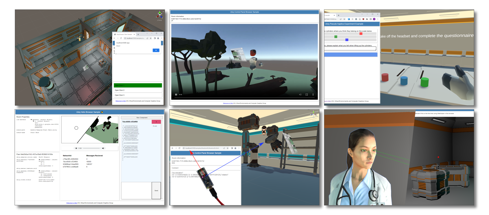
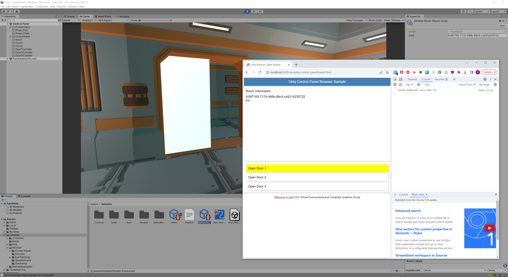
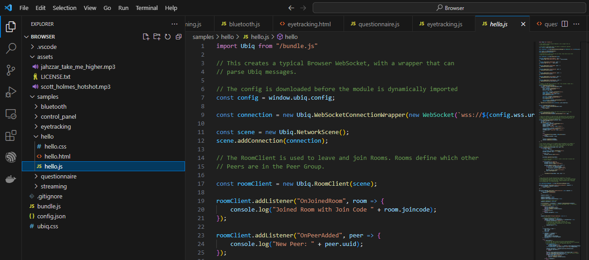

## Introduction

At [Web3D](https://web3d.siggraph.org/cfp/) 2023 we presented a paper on one of our recent projects, [Extending the Open Source Social Virtual Reality Ecosystem to the Browser in Ubiq](https://discovery.ucl.ac.uk/id/eprint/10178840/).

In this project we set up Ubiq to build a library enabling Ubiq Peers to be written in JavaScript for the browser.

Ubiq has always supported the browser, but this work takes it much further. 

To start with, we now have only one JavaScript codebase, and the browser library builds from this using [Rollup](https://rollupjs.org/), ensuring parity between our NodeJs and Browser classes going forward, and making samples for one applicable to the other.




While JavaScript is JavaScript, Node and the Browser have slight differences which required tweaks to how our modules are written and the project configured.

The result is a static library that can be imported into any tab, turning it into a Ubiq Peer. Components can be written in JavaScript to talk to other tabs, or Components on other platforms.

In this post we discuss the motivation behind this library, and how to get started with it.


## Asymmetric Social VR

While the library allows browser tabs to communicate symmetrically, this project was inspired by *asymmetry* in social VR.

Most Social VR applications have just one client, ported to different platforms. But this often precludes leveraging the unique benefits of a particular platform.

Over the years however various systems have shown how embracing asymmetry can yield unique and exciting experiences.

Asymmetric systems such as [*Desert Rain*](https://www.blasttheory.co.uk/projects/desert-rain/) from Blast Theory: a collaborative mixed reality game based on the Gulf War. Users experienced a narrative designed to blur the real and the virtual through activities that alternated between virtual presentations and real props, with strong dependencies between them; for example, visitors receiving physical items achieved in virtual reality and vice-versa.




[Out of this World](https://history.siggraph.org/learning/creating-a-live-broadcast-from-a-virtual-environment-by-greenhalgh-bowers-walker-wyver-benford-et-al/) was a game show that took place in VR but was broadcast on live television - the producers set up virtual studio cameras with familiar controls, and hooked up their outputs to real-world analogue mixing stations, keeping their familiar processes and systems.




## Roles

One of the topics raised by these is the importance of *roles* in Social VR. 

Any social situation more complex than a basic conversation has specific roles. Roles like *performer*, *moderator*, *visitor*, *guide*, etc...

The importance of supporting these roles *technically* is exemplified by platforms such as [The Under Presents](https://tenderclaws.com/theunderpresents) and games like [Keep Talking and Nobody Explodes](https://keeptalkinggame.com/).

In The Under Presents, [performers](https://www.youtube.com/watch?v=nj7YMdytpE4&ab_channel=MetaQuest) have [special abilities](https://medium.com/alive-in-plasticland/lets-dive-into-the-under-presents-tempest-pt-1-2d1ef2168c5f) and presentations unavailable to regular visitors, that they outfit their avatars with in an out-of-world "dressing room".



But it is not just about permissions.

In Keep Talking and Nobody Explodes, platform asymmetry is used as a game mechanic: some players, out of VR with pencil and paper props have to talk an immersed player through defusing a virtual bomb, using only the instructions from their non-immersed friends.



As Anthony (*SkarredGhost*) Vitillo [describes](https://skarredghost.com/2020/07/04/how-to-organize-vr-concert-lessons/) in a post-mortem of a virtual concert, most tasks involved in running such an event are carried out far more efficiently on non-immersed interfaces. Producers also require insights into how the system is operating and what people are doing, that are much better provided through abstract views.

> If you want to enjoy an event, do it in VR; if you want to manage an event, do it in 2D.

*Anthony Vitillo - [Behind the scenes of the VR concert Welcome To The Other Side](https://skarredghost.com/2021/01/05/jean-michel-jarre-vr-concert-postmortem/)*

When systems deny that different users need different capabilities, it can make it hard to explore other types of social situations.


## Browser Peer

As Ubiq fully exposes the message-based nature of distributed applications, it is highly amenable not just to cross-platform use, but *asymmetric* cross-platform use, provided messages can be serialised, and importantly addressed in a consistent way.

Our browser library is not intended to draw a 3D world, but to allow the browser to act as a Peer *natively* - for user code to use all the browser's features to craft messages and communicate with Components on other platforms in order to manipulate the shared world.

The modern web browser is a significant computing platform in its own right. Not only does it have a very complete language with an enormous community, and excels at building rich 2D interfaces, but it also has multimedia support, and even USB & Bluetooth device support.




Based on the asymmetric systems above, we created a set of samples to show what can be achieved with a native Browser Peer.

These include:

* Wizard-of-Oz Control of an Immersive Environment
* Streaming Video from within a Virtual World
* Interactive Questionnaires linked dynamically to Immersed behaviour
* Control Panels showing the internals of how the System functions
* Device Interaction: in this case controlling the gravity vector of a Physics Simulation with an IMU
* Using a Webcam-based Eye Tracker to control the Gaze of a Virtual Character


## Getting the Code

To get started, clone the [samples-browserextended](https://github.com/UCL-VR/ubiq/tree/samples-browserextended) branch.

The `Browser` folder contains all the assets for the Browser platform, including the library (`bundle.js`). Additional scenes and supporting files are in Unity and Node as well.


### Running the Samples

1. After cloning, make sure to run the Unity Project at least once. This will create a unique Room GUID for your individual checkout, shared by all the samples.
2. Serve the `/Browser` directory with a simple static HTTP server. For example with the [Live Server Plug-in](https://github.com/ritwickdey/vscode-live-server) in VSCode, or [http-server](https://www.npmjs.com/package/http-server) in NodeJs.
3. Navigate to the html page of the sample. For example, [http://localhost:5500/samples/hello/hello.html](http://localhost:5500/samples/hello/hello.html)


The sample page will configure itself using the `config.json` file in `/Browser`.

Once the page has loaded, explore the sample however you like!

Most of the samples have a VR counterpart as well. These are in the Unity project under `Assets/Samples/Browser`.



Above, the Control Panel Sample runs in the browser (`samples/control_panel/panel.html`) and in Unity (`Assets/Samples/Browser/Control Panel/Control Panel.unity`). The browser interface is used to open the first door.

There is no additional setup required to run the samples - just make sure that `config.json` matches the settings in `Nexus.asset` and `Sample Room.asset`. 

If `config.json` ever gets out of sync or is not created properly, in the Unity Editor, use the Ubiq -> Update Sample Configs menu entry to rebuild it.


### Sample Construction

All the samples follow a similar layout for ease of exploration.

Each sample has its own folder under `samples`. Within this folder is the HTML page, where most of the DOM elements are defined, and any local resources such as CSS files.



The JavaScript is always contained in a separate .js file, which is a conformant ESM ([ECMAScript Module](https://developer.mozilla.org/en-US/docs/Web/JavaScript/Guide/Modules)). This module is loaded into the page through a `script` tag.

There is a little indirection however, so that the page can get the config file first.

```
<script>
  fetch("/config.json").then(x => x.text()).then(config =>{
	window.ubiq = {
	  config: JSON.parse(config),
	  app:  import("./hello.js")
	}
  })
</script>
```

However, if for your own application you didn't want to get a config file this way, you could as easily write:

```
<script>
	window.app = import("./app.js");
</script>
```

The entire sample code, both the netcode and that to drive the UX, is within the single module.

The first thing the module does is import the library into the Ubiq namespace.

```
import Ubiq from "/bundle.js"
```

It then proceeds to set up the application, very similarly to Unity.

The only major difference is that since JavaScript does not have a native scene graph, things like the references between Components must be set up explicitly by initialising them in order.


```
const connection = new Ubiq.WebSocketConnectionWrapper(new WebSocket(`wss://${config.wss.uri}:${config.wss.port}`));

const scene = new Ubiq.NetworkScene();
scene.addConnection(connection);

// The RoomClient is used to leave and join Rooms. Rooms define which other
// Peers are in the Peer Group.

const roomClient = new Ubiq.RoomClient(scene);

roomClient.addListener("OnJoinedRoom", room => {
    console.log("Joined Room with Join Code " + room.joincode);
});

roomClient.addListener("OnPeerAdded", peer => {
    console.log("New Peer: " + peer.uuid);
});

...
```

The samples use an event-based architecture, as is typical in JavaScript. The samples set up all the events, for both Ubiq Components and the DOM, before finally joining the pre-defined room. Joining the Room kicks off the first set of event handlers and starts messages flowing from other Peers, which are received by the other callbacks in the JavaScript sample and drive its behaviour.

To interact with the VR world, existing (e.g. `RoomClient`, `LogCollector`) Components are used, or new ones created. 

Creating new Components is straightforward. Components are regular JavaScript classes that implement a `processMessage` method, like in Unity.

Classes should register themselves with the `NetworkScene` created explicitly by the application, by which they receive a `NetworkContext` to send messages.

Like on the desktop, `NetworkIds` can be specified explicitly from strings or numbers, and derivative IDs can be created too. 

Below is the `Door` class from the Control Panel sample:

```
class Door {
    constructor(scene, doorName){
        this.doorName = doorName;
        this.context = scene.register(this, Ubiq.NetworkId.Create(experimentNamespace, doorName));
        this.element = document.getElementById(doorName);
        this.element.onclick = () =>{
            this.context.send("Open");
        };
    }

    processMessage(m){
        switch(m.toString()){
            case "Opening":
                this.element.style = "background-color: yellow";
                break;
            case "Opened":
                this.element.style = "background-color: green";
                break;
            case "Notify":
                window.alert(this.doorName);
                break;
        }
    }
}
```

Of course to affect the VR world, a Component is needed in Unity to receive the "Open" message:

```
public class Door : MonoBehaviour
{
    public AnimationCurve Curve;
    public ControlPanelDoorBuzzer Buzzer;

    private static NetworkId experimentNamespace = new NetworkId("9ea1be44-a29787fd");
    private NetworkContext context;
    private float time;
    private Vector3 startPosition;

    // Start is called before the first frame update
    void Start()
    {
        context = NetworkScene.Register(this, NetworkId.Create(experimentNamespace, gameObject.name));
        startPosition = transform.localPosition;
        Buzzer.OnBuzz.AddListener(Notify);
    }

    void Notify()
    {
        context.Send("Notify");
    }

    // Update is called once per frame
    void Update()
    {
        transform.localPosition = startPosition + transform.right * Curve.Evaluate(time);
    }

    public void ProcessMessage(ReferenceCountedSceneGraphMessage message)
    {
        switch(message.ToString())
        {
            case "Open":
                StartCoroutine(OpenDoor());
                break;
        }
    }

    private IEnumerator OpenDoor()
    {
        context.Send("Opening");
        while (time < 1f)
        {
            time += Time.deltaTime;
            yield return 0;
        }
        time = 1f;
        context.Send("Opened");
    }
}
```

We recommend the Control Panel sample to start with as the whole Js module is less than 60 lines, and easier to parse than some of the more complex ones.


## Discussion

Our hope is that the samples serve as documentation, as well as a demonstration of what can be achieved with the Browser.

However the samples do cover a lot of ground. We will follow up with more posts discussing specific aspects of the JavaScript API and cross-platform interop. 

And as always, do reach out to the team via e-mail or [GitHub](https://github.com/UCL-VR/ubiq/discussions) with any questions!

We recommend for the moment that only the `samples-browserextended` branch is used to build `bundle.js`, as there are some slight upstream (Node JavaScript) changes. The branch does work with nexus though, and soon all changes will be incorporated into our main branch, so the only thing special about the branch will be the samples. The samples will remain separate as some of them use non-trivially sized assets.

When it comes to cross-platform functionality, the importance of a portable *serialisation library* and *transport protocol* are well known. However, *addressing* - getting the de-serialised message to the right place - is just as important for making code understandable and maintainable.

Ubiq's metaphor of objects messaging other objects using portable IDs that can be created across platforms the same way, maps well to different languages.

We hope that it is clear from the Door sample above, that though the language has changed, the way in which the application is built has not, and that it should be no harder to create a Component that talks across platforms, than one that talks only within one.

Sharing the message passing functionality across platforms is not always straightforward. All the functions involved, such as the hashing and binary processing, have to be portable, and we detail some of the challenges in the paper.

However, once this subset of functionality is shared, the code that makes the message can do almost anything. This allows us above to leverage special features of the browser unavailable to Unity (or other platforms).

It is the same principle that enables the [integration of LLMs](https://ubiq.online/blog/ubiq-genie/) into sessions, and specific [mixed-reality features](https://nels.dev/publication/vrst2022/).

Combining this with the browser's distinctive security model is also a rich topic to explore.

With this updated workflow our JavaScript code will get more frequent updates. Further the lessons and modifications from this project will only make it easier to extend to other interesting platforms natively too.