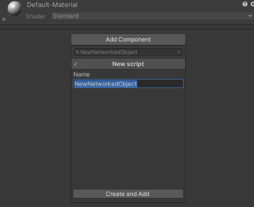
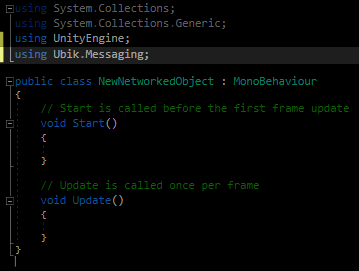
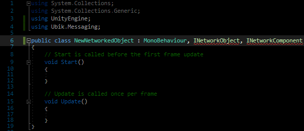
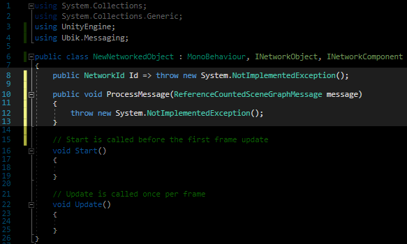
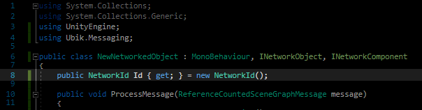
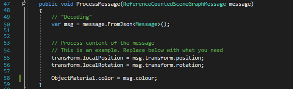

## Building a Basic Networked Object

1. Create a new Unity Script and add it to your GameObject that you want to have networked. You can do this via the inspector by clicking on "Add Component" and typing the new name.

2. Include Ubiq.Messaging

3. Inherit from INetworkObject and INetworkComponent

4. Implement their interfaces In Visual Studio this can be done through the context menu. Right Click -\> Quick Actions and Refactoring -\> Implement interface **Note**: This will only give you the stubs. You will need to fill them in yourself in the next steps

5. Implement Network ID creation

6. Register your networked object with the network Scene This should be done at the start of the objects life i.e. in the Start() function. If you want to send messages as well, you also need to save the context object that is returned.

7. Define how your message will look like. This is best done as a struct in the class. It being defined in the class prevents naming conflict. In the message, write the variables that you want to send. A good start is TransformMessage that is built to store the transform and is useful if you want your object's location and orientation to be synchronised. Do not forget the constructor! It allows to create the message in one line.

8. Receiving Messages Messages are received automatically. However, you will have to define how they are processed. For that, fill in ProcessMessage(…) The first step is usually "decoding" the message. Usually it will be sent as a JSON, but if you send it in a different format, you need to decode it differently as well.

9. Sending Messages You can send messages at any time and anywhere in the code through using your context object. However, most of the time you will probably want that the objects move in sync, so it makes sense to send an update each frame. For this, put your sending in Update(…).

