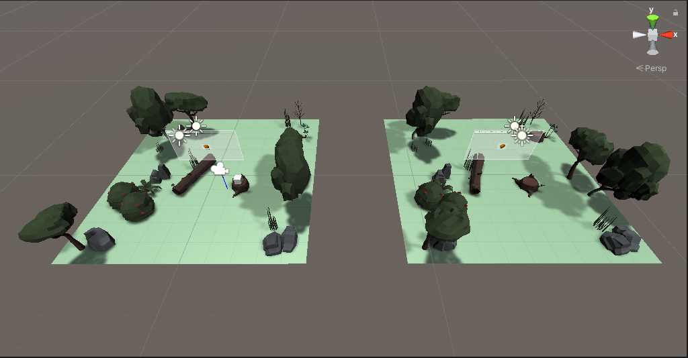
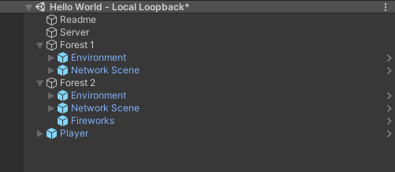

## Testing Networked Objects

A local loopback scene is included in the Ubiq samples. Local loopback is helpful for testing your networked objects without needing to use any external applications. The scene contains two clients and a local server that is started when you play the scene.

The scene is in the Samples/Intro folder. To get started:

1. Click the play button. The local server is now started and you will see an avatar in one forest. At this stage, neither client is connected to the server.

2. Expand the hierarchy for Forest 1 and click on the GameObject with the name "NetworkScene" within (see left image below). In the Inspector panel, click Create Room (right image below).

3. Expand the hierarchy for Forest 2 and click the other "NetworkScene" GameObject. In the Inspector panel, click Refresh and you will see the room you just created. Click to join the room.

Now both clients are connected to the local server and you can test your networked objects. You will notice both Forests now have avatars inside and that the avatars move in sync. There are now 4 avatars in the scene, 2 in each forest, but they share a position. This is because their positions and orientations are derived from the same player prefab.

