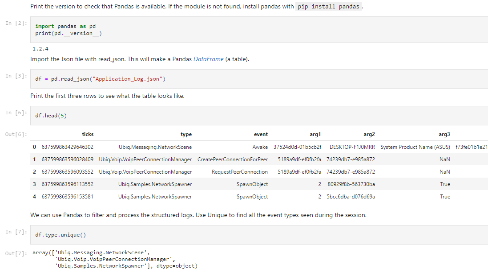
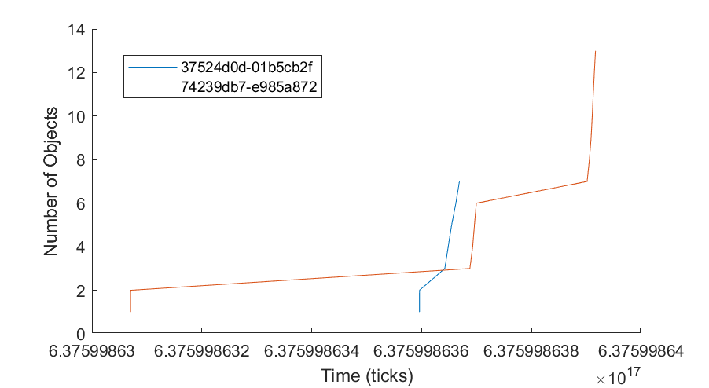

The Event Logger outputs structured logs, as Json objects. These can be processed on any platform that can read Json files.

A sample log file is shown below.

 
[
{"ticks":637599657099341295,"type":"Ubiq.Messaging.NetworkScene","event":"Awake","arg1":"0112f691-0c94838b","arg2":"DESKTOP-F1J0MRR","arg3":"System Product Name (ASUS)","arg4":"f73fe01b1e21031d49274a1491d1d6b5714c92e9"},
{"ticks":637599657429701260,"type":"Ubiq.Voip.VoipPeerConnectionManager","sceneid":"0112f691-0c94838b","objectid":"0112f691-0c94838b","componentid":50,"event":"CreatePeerConnectionForRequest","arg1":"7a577253-a3a38c7f"},
{"ticks":637599657364232680,"type":"Ubiq.Messaging.NetworkScene","event":"Awake","arg1":"53c9dddd-a62bb937","arg2":"Oculus Quest","arg3":"Oculus Quest","arg4":"b8db4746286db62ecad4c6fa13f17ab6"},
{"ticks":637599657421868190,"type":"Ubiq.Voip.VoipPeerConnectionManager","sceneid":"53c9dddd-a62bb937","objectid":"53c9dddd-a62bb937","componentid":50,"event":"CreatePeerConnectionForPeer","arg1":"7a577253-a3a38c7f","arg2":"0112f691-0c94838b"},
{"ticks":637599657422314320,"type":"Ubiq.Voip.VoipPeerConnectionManager","sceneid":"53c9dddd-a62bb937","objectid":"53c9dddd-a62bb937","componentid":50,"event":"RequestPeerConnection","arg1":"7a577253-a3a38c7f","arg2":"0112f691-0c94838b"}
]


In this example, two peers - a desktop PC (Unity Editor) and an Oculus Quest - join a room. The NetworkScene and VoipPeerConnectionManager both log events. To collect these logs, a new LogCollector was added to a new GameObject and the Start Collection button pressed.

Some Json members are defined by the Logger type. For example, the ContextLogger writes the sceneid and objectid of the context passed to it on creation. The arg members correspond to those passed to the Log() method.

## Python

Python can be used to analys logs programmatically. The Jupyter notebook below shows how to import and process logs using Pandas, a powerful data analysis library for Python.

* See the Notebook in full
* Download Jupyter Notebook
* Download Example Log File

## Excel

Structured event logs are amenable to being viewed in a table. Microsoft Excel PowerQuery can import Json files and load events into Excel Worksheets.

To do this:

1. Open a new Workbook
2. From the Data tab, choose Get Data -> From File -> From Json
3. Open the log file, for example Application_log_2021-04-23-10-56-03_0.json
4. Select the List header and click Convert To Table. This will instruct Excel to treat each entry as a row.
5. Leave the Default Values in place and Click OK. The View will now appear as a Column.
6. Use the button in the top right to add the Expand Column step. This will split each record into a set of columns. Make sure to click Load More... if visible to ensure you get every possible field in the table.
7. Click OK
8. Click Close & Load to build your table.

You can now order by Ticks, and filter columns such as Events.

## Matlab

Like Python, Matlab can load Json using the jsondecode function.

 
% Read the text file and use jsondecode to produce a cell array of
% structures.

J = jsondecode(fileread("Application_Log.json"));

% The structures will have different fields, so we must use loops to filter
% them as they cannot be combined into a single struct array or table.

% Below, find all the events of type SpawnObject, and combine them into a
% new array.

spawn = [];

for j = J'
   % The curly braces access the contents of the cell j, which is the
   % struct.
   s = j{1};
    if categorical(cellstr(s.event)) == categorical("SpawnObject")
        spawn = [spawn; s];
    end
end

% Convert the new array into a table
T = struct2table(spawn);

% Use the table to change the type of the sceneid column so we can easily
% split the events by which peer they are from.
T.sceneid = categorical(T.sceneid);

% Filter the events to keep only those at the spawner
T = T(T.arg3,:);

% Plot the number of objects spawned over time, for each Peer
figure;
hold all;
peers = unique(T.sceneid);
for p = peers'
   spawned = T(T.sceneid == p,:);
   plot(spawned.ticks,1:size(spawned,1));
end

xlabel("Time (ticks)");
ylabel("Number of Objects");
legend(peers);
 

* Download Matlab Source
* Download Example Log File