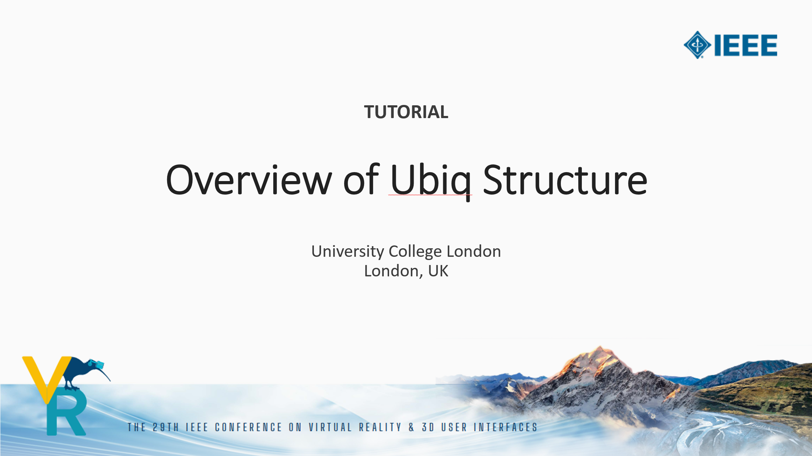
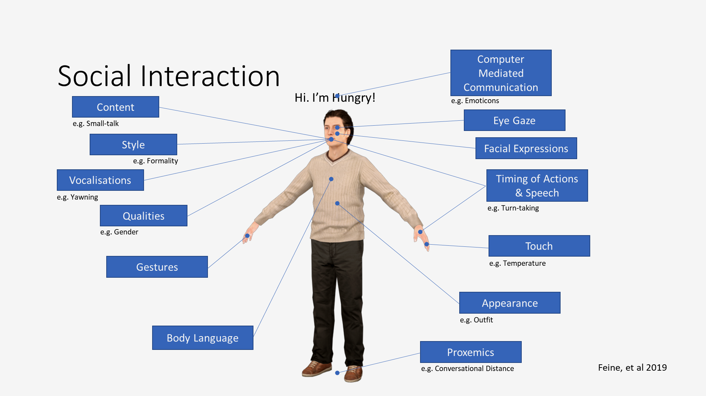
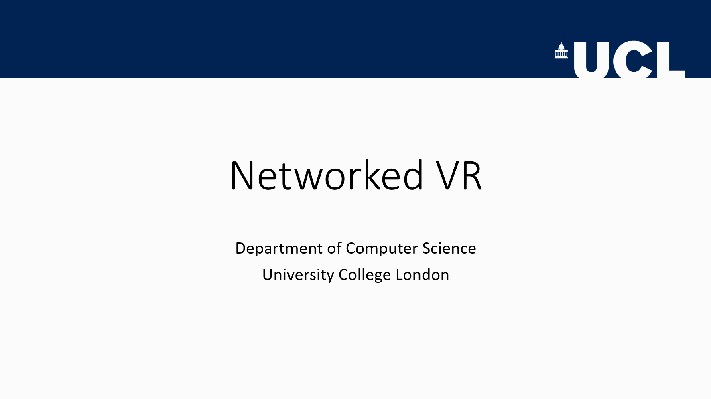

This page contains teaching materials that have been used in modules and tutorials featuring Ubiq.

#### IEEE VR 2022 Tutorial Slides

Presentation given at IEEE VR 2022 as part of the Ubiq Tutorial.
 

#### UCL COMP0113 Virtual Environments Module Ubiq Lab Tutorial Slides

Slides for the lecture-style component of the Ubiq Lab Tutorials

#### UCL COMP0113 Virtual Environments Module Networking Lecture Slides

Two-hour lecture on Networked VR given as part of the UCL Computer Science Virtual Enrivonments Module.

